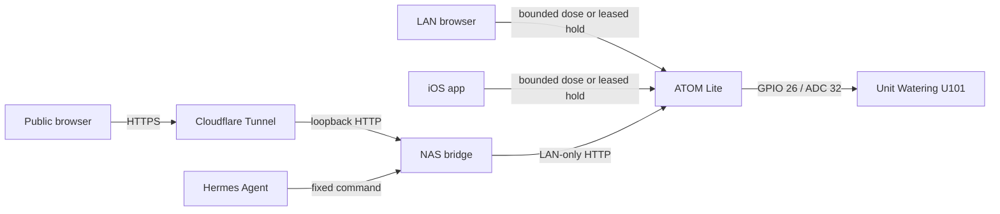

# Balcony Watering

[](https://github.com/kandotrun/tree/actions/workflows/ci.yml)
[](https://github.com/kandotrun/tree/actions/workflows/ios.yml)

A fail-safe watering controller for one balcony tree, built with an M5Stack
ATOM Lite, Unit Watering U101, and a NAS bridge. The device stays LAN-only;
an anonymous, tightly bounded public gateway can be exposed separately.

> [!CAUTION]
> This project controls a real water pump. Keep the outlet over a measuring
> container until flow calibration, timeout, power, drainage, leak, and siphon
> tests all pass. Automatic scheduling must remain disabled during the initial
> two-week supervised pilot.

## Architecture



The ATOM Lite owns the physical safety boundary: pump-off boot, independent
cutoff timers plus watchdog, five-minute boot guard, bounded-duration
requests, a leased dead-man hold mode, request deduplication, and emergency stop. The bridge owns
request IDs, SQLite history, tank estimation, scheduling decisions, public
cooldown/quotas, and machine-readable results.

## Safety model

- GPIO 26 is configured as `OUTPUT` and driven `LOW` before Wi-Fi, NVS, LED, or
  sensor setup. U101's official schematic also shows a 10 kΩ gate-to-source
  pull-down (`R1`) on its active-high N-MOSFET switch, keeping the pump off while
  the host GPIO is high-impedance during reset.
- The dashboard may request an integer `duration_sec` from 1 to 180. Firmware
  validates it against `MAX_RUN_MS` and retains an independent 180-second local
  cutoff. No client can request volume or bypass the cutoff. Bridge/Hermes
  commands intentionally omit duration and use the configured default dose.
- For longer supervised watering, the dashboard has a press-and-hold control.
  It sends a heartbeat every 500 ms; the ATOM's independent 1,500 ms lease
  timer cuts GPIO 26 LOW if heartbeats stop. A hold has a fixed ten-minute
  absolute cap, and its keepalive endpoint cannot start or restart watering.
  Official M5Stack documentation states a manufacturer-rated 5 W pump, but
  power draw and continuous duty have not been measured on this installed unit.
  Ten minutes is provisional and must not be increased before heat, flow, and
  drainage are measured on the installed system.
- The accepted request ID is persisted before the physical pump pin goes high.
- The default cooldown is zero: after a dose completes or is manually stopped,
  a new request with a distinct ID can start immediately. The active dose still
  stops at its accepted duration and never becomes an unbounded run.
- An ambiguous `POST /v1/water` is never retried automatically. The event stays
  `UNKNOWN` and blocks later watering until an operator investigates.
- Firmware starts **unarmed**. `WATERING_ARMED` must remain `false` until the
  outlet points into a measuring container and commissioning checks pass.
- The bridge refuses public ATOM destinations. Port forwarding, public DNS,
  and Tunnel ingress must never point directly to the ATOM.
- The ATOM watering/status API, embedded dashboard, and public gateway
  intentionally have no application-layer authentication. Firmware maintenance
  is a separate boundary: physical-button pairing provisions a device-local key,
  and each OTA upload requires a fresh nonce plus HMAC-SHA256. Keep the ATOM on
  a trusted WPA2/WPA3 LAN or isolated IoT VLAN. Anonymous Internet traffic
  reaches only the NAS gateway,
  which fixes each run to 10 seconds, applies a global 60-second cooldown plus
  rolling hourly/daily quotas, excludes hold mode, and always permits stop.

Software safety controls reduce risk; they do not replace drainage, leak,
siphon, power, weatherproofing, and physical inspection.

## Repository map

```text
firmware/  ESP32 firmware and host-side state-machine tests
bridge/    NAS CLI/public gateway, SQLite state, assets, and tests
ios/       Native SwiftUI LAN client, safety core, and tests
docs/      Japanese design and staged commissioning guide
scripts/   Flash and serial-monitor helpers
```

## Build and test

### Firmware

Install PlatformIO Core, then build with the checked-in safe placeholder config:

```bash
uv tool install --with pip 'platformio==6.1.19'
cp firmware/include/config.example.h firmware/include/config.h
cd firmware
pio test -e native
pio run -e m5stack-atom
```

`config.h` is ignored by Git. Replace the Wi-Fi placeholders locally and keep
`WATERING_ARMED false` for the first flash.
See [the development guide](docs/development-guide.md) before connecting U101.

### Embedded dashboard

After flashing firmware v0.4.1 or later, open the ATOM Lite's LAN address in a
browser. The device serves a mobile-first dashboard with live ADC history,
browser-local dry/wet calibration, bounded 1-180 second manual watering,
dead-man press-and-hold watering for up to ten minutes, confirmation, and
emergency stop. It opens directly without a login or API token. Moisture
percentages are reference-only and never trigger watering automatically.

When editing `firmware/web/index.html`, regenerate and verify the compressed
flash asset:

```bash
python3 firmware/scripts/generate_dashboard_header.py
python3 firmware/scripts/generate_dashboard_header.py --check
```

### iOS app

The native SwiftUI app connects directly to the ATOM on the same Wi-Fi. It
provides live status, bounded confirmed doses, leased press-and-hold watering,
emergency stop, and explicitly confirmed firmware updates without a cloud
service or login. The installed device
address is entered and stored on the iPhone; it is not committed to this repo.

```bash
brew install xcodegen
xcodegen generate --spec ios/project.yml
open ios/TreeWatering.xcodeproj
```

See [`ios/README.md`](ios/README.md) for local-network permissions, physical
device signing, safety behavior, and test commands.

### Bridge

```bash
uv sync --project bridge --extra test --locked
uv run --project bridge pytest bridge/tests
uv run --project bridge ruff check bridge
uv run --project bridge ruff format --check bridge
```

The installed package exposes only fixed commands:

```text
water-tree           Request one configured dose
water-tree-status    Read ATOM and tank state
water-tree-stop      Stop the pump immediately
water-tree-refill    Reset estimated usable tank volume
water-tree-schedule  Water only when the configured interval is due
tree-moisture-logger Record read-only ATOM telemetry to SQLite
```

There is deliberately no runtime or volume argument. See
[`bridge/README.md`](bridge/README.md) for configuration, JSON output, exit
codes, and the optional systemd timer.

### Anonymous public gateway

The package also installs `tree-public-gateway`. It serves a single-action
public page from a loopback-only NAS listener. `POST /api/water` accepts only an
empty JSON object; the server supplies the fixed 10-second duration. The gateway
uses an atomic SQLite reservation, a 60-second global cooldown, a six-per-hour
limit, and a 24-per-day limit. Ambiguous device POST results are not retried and
continue to consume quota. Hold mode and arbitrary duration are never exposed.

Use Cloudflare Tunnel only from the NAS listener to the public hostname. See
[`docs/public-gateway.md`](docs/public-gateway.md) for deployment, verification,
and rollback.

### Moisture telemetry

`tree-moisture-logger` polls the LAN-only status endpoint without issuing any
actuation command and stores calibration history in a private SQLite database.
It defaults to a 10-second interval and 90-day retention, but recorded ADC
values never trigger automatic watering. See
[`docs/moisture-telemetry.md`](docs/moisture-telemetry.md) for NAS deployment,
verification, retention, and shutdown.

## Current status

- Firmware compiles for `m5stack-atom` and its pure safety state machine has
  native tests.
- Bridge behavior, SQLite transitions, HTTP handling, and no-retry semantics
  have automated tests.
- Firmware safety paths were physically flashed and verified for boot guard,
  bounded one-shot watering, dead-man hold lease expiry, keepalive, manual stop,
  and local pump-off behavior. The v0.4 dashboard is automated-test, browser,
  and on-device asset verified. v0.4.1 removes application authentication
  without changing the physical safety paths. Its no-auth behavior is not
  treated as physically verified until each flashed device returns status and
  dashboard responses without credentials while reporting the pump off.
- Firmware v0.5.0 advertises `balcony-watering.local` as
  `_tree-watering._tcp` and adds read-only API identity markers for the iOS
  auto-discovery flow. The iOS flow was manually exercised with a local Bonjour
  proxy and read-only mock on an iOS 26 simulator; CI preview screenshots do not
  exercise runtime discovery. v0.5.0 remains physically unverified until it is
  flashed to the ATOM and the boot-off, Bonjour, and status checks are repeated.
- Measured flow, waterproofing, power endurance, drainage, siphon behavior, and
  the supervised pilot remain incomplete.
- Automatic scheduling remains disabled by default.

## Documentation

- [System design (Japanese)](docs/system-design.md)
- [Development and commissioning guide (Japanese)](docs/development-guide.md)
- [Anonymous public gateway (Japanese)](docs/public-gateway.md)
- [Moisture telemetry logger (Japanese)](docs/moisture-telemetry.md)
- [iPhoneからのファームウェア更新](docs/firmware-ota.md)
- [Agent and contributor rules](AGENTS.md)
- [Security policy](SECURITY.md)

## Public repository policy

Commit examples only. Never commit Wi-Fi credentials, private
network inventories, SSH/Tailscale material, runtime databases, or real logs.
Use a staged-file secret scan before every push.

## License

[MIT](LICENSE)
