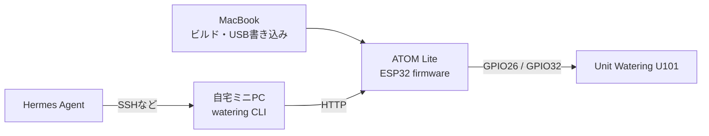
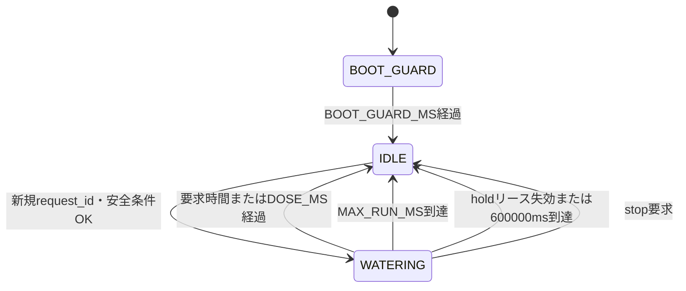

# ベランダ自動水やりシステム 開発ガイド

- Version: 0.4
- 更新日: 2026-08-08
- 対象ハードウェア: M5Stack ATOM Lite + Unit Watering U101
- 対象環境: macOS、PlatformIO、自宅LinuxミニPC、Hermes Agent
- 関連文書: [システム設計書](./system-design.md)

> この文書は実装仕様と作業手順である。給水量、水分校正値、電源条件は実機コミッショニングの完了まで暫定値として扱う。

## 1. 開発の全体像

開発対象は2つに分かれる。

1. ATOM Liteへ書き込むESP32ファームウェア
2. 自宅ミニPCで動かす給水CLIとHermes連携



MacBookは初回開発とファームウェア更新に使う。通常運用時はMacBookを必要としない。

## 2. 推奨リポジトリ構成

```text
balcony-watering/
├── README.md
├── docs/
│   ├── system-design.md
│   └── development-guide.md
├── firmware/
│   ├── platformio.ini
│   ├── include/
│   │   ├── config.example.h
│   │   └── config.h              # Git管理外
│   ├── src/
│   │   └── main.cpp
│   └── test/
├── bridge/
│   ├── pyproject.toml
│   ├── balcony_watering/
│   │   ├── __init__.py
│   │   ├── cli.py
│   │   ├── atom_client.py
│   │   ├── state.py
│   │   └── config.py
│   ├── config.example.env
│   ├── systemd/
│   │   ├── balcony-watering-daily.service
│   │   └── balcony-watering-daily.timer
│   └── tests/
└── scripts/
    ├── flash.sh
    └── serial-monitor.sh
```

初期実装では単一リポジトリとする。ハードウェア仕様、ファームウェア、ミニPC側実装を同じ履歴で管理できるためである。

## 3. ハードウェア接続

### 3.1 ATOM LiteとU101

ATOM LiteのGroveカスタムポートをU101へ付属ケーブルで接続する。

| 信号 | ATOM Lite | U101での用途 |
|---|---:|---|
| GND | GND | 共通GND |
| 5V | 5V | U101およびポンプ電源 |
| PUMP_EN | GPIO26 | ポンプON/OFF |
| Analog Output | GPIO32 | 水分センサーADC |

U101公式回路図では、active-highのN-MOSFET（Q1）のゲートとソース間に10kΩプルダウン（R1）が実装されている。
ATOMのGPIOがリセット中にhigh-impedanceでもポンプ入力はLOWへ保持される。
これに加えて、ファームウェアは最初のハードウェア操作でGPIO26をLOWへ設定し、実機の10回電源試験でも確認する。

接続・取り外しはUSB電源を抜いた状態で行う。

### 3.2 チューブ

- 吸水側: 20Lタンク
- 吐出側: 鉢
- 最初は鉢へ入れず、計量容器へ出す
- 本体または説明書のIN/OUT表示を確認する
- タンクの空気取入口を開ける

### 3.3 電源

- Mac書き込み時: MacBookのUSB
- 机上試験: 5V / 2A以上のUSB電源
- 屋外試験: 所有するモバイルバッテリー
- ポンプ始動時にATOMが再起動する場合は、電源またはケーブルを変更する

## 4. MacBookの開発環境

### 4.1 必要なもの

- データ通信対応USB-Cケーブル
- Git
- Python 3またはHomebrew
- PlatformIO CLI

PlatformIOは次のいずれかで導入する。

```bash
brew install platformio
```

または、`uv`を利用している場合:

```bash
uv tool install platformio
```

確認:

```bash
pio --version
```

### 4.2 USB認識

ATOM LiteをMacへ接続後、次を実行する。

```bash
pio device list
ls /dev/cu.*
```

シリアルポートが表示されない場合は次を確認する。

1. USBケーブルがデータ通信対応か
2. 別のUSBポートまたはハブで認識するか
3. macOSのシステム情報にUSBデバイスが表示されるか
4. M5Stack公式案内のFTDI VCPドライバーが必要か

ドライバーは認識しない場合のみ追加する。最初から複数のドライバーを入れない。

## 5. PlatformIO設定

`firmware/platformio.ini`の初期案:

```ini
[env:m5stack-atom]
platform = platformio/espressif32@6.13.0
board = m5stack-atom
framework = arduino
upload_speed = 1500000
monitor_speed = 115200

build_flags =
    -DCORE_DEBUG_LEVEL=3

lib_deps =
    bblanchon/ArduinoJson@7.4.3
    adafruit/Adafruit NeoPixel@1.15.5
```

アップロードが不安定な場合は`upload_speed`を`115200`へ下げて再試行する。

## 6. 秘密情報と設定

`firmware/include/config.example.h`:

```cpp
#pragma once

#define WIFI_SSID "CHANGE_ME"
#define WIFI_PASSWORD "CHANGE_ME"

#define DEVICE_NAME "balcony-watering"
#define FIRMWARE_VERSION "0.4.1"
#define PUMP_PIN 26
#define MOISTURE_PIN 32
#define LED_PIN 27

// 実機の事前確認が終わるまでfalseのままにする
#define WATERING_ARMED false

#define DOSE_MS 10000UL
#define MAX_RUN_MS 180000UL
#define COOLDOWN_MS 0UL
#define BOOT_GUARD_MS 300000UL
```

開発時はコピーして`config.h`を作る。

```bash
cp firmware/include/config.example.h firmware/include/config.h
```

`.gitignore`へ必ず追加する。

```gitignore
firmware/include/config.h
bridge/.env
bridge/*.db
.pio/
```

`DOSE_MS=10000`は`duration_sec`を省略するBridge/Hermes用の標準10秒である。
管理画面はリクエストごとに1-180秒を指定できるが、`MAX_RUN_MS`と
ファームウェアの180秒絶対上限を超えられない。
長時間給水は別のhold APIを使い、クライアント指定時間ではなく、固定1,500ms
リースを500msごとの生存信号で延長する。1回のholdは固定600,000msで停止する。
`COOLDOWN_MS=0`のため、完了または手動停止の直後から別`request_id`の次要求を受け付ける。

## 7. ファームウェア責務

ファームウェアは次の処理だけを担当する。

- Wi-Fi接続と再接続
- HTTP API
- ポンプ状態機械
- ローカル停止タイマー
- 水分ADC取得
- `request_id`の重複拒否
- LEDとシリアルログ
- ウォッチドッグ

スケジュール、推定タンク残量、Hermes向け文章生成はミニPC側へ置く。

## 8. 起動処理

起動順序は安全性のため固定する。

```text
1. GPIO26をOUTPUTに設定
2. GPIO26をLOWに設定
3. シリアル開始
4. LEDを初期状態にする
5. 保存設定を読み込む
6. Wi-Fiへ接続
7. HTTPサーバー開始
8. 5分間のBOOT_GUARD
9. IDLEへ遷移
```

Wi-Fi接続より前にpump OFFを確定する。

## 9. 状態機械



### 状態ごとのGPIO

| 状態 | GPIO26 | APIの給水受付 |
|---|---|---|
| BOOT_GUARD | LOW | 拒否 |
| IDLE | LOW | 受付可能 |
| WATERING | HIGH | 拒否 |
| COOLDOWN（互換） | LOW | `COOLDOWN_MS>0`を明示設定した場合だけ拒否 |
| ERROR | LOW | 拒否 |

`delay(DOSE_MS)`は使わず、`millis()`を使った非ブロッキング制御にする。
これにより給水中でも緊急停止と状態確認を受けられる。
給水開始時にはメインループから独立したone-shotタイマーを受理済みの要求時間で起動し、ループ停止時もその時間でGPIO26をLOWへ落とす。要求時間は`MAX_RUN_MS`と180秒絶対上限を超えられない。
hold開始時は同じ独立タイマーを1,500msで起動し、同一`request_id`の有効な
keepaliveだけがタイマーを延長する。タイムアウト済みの安全ゲートはkeepaliveで
再armせず、keepalive単体ではIDLEからWATERINGへ遷移しない。
タスクWatchdogはその予備停止手段とする。

## 10. HTTP API仕様

ATOMは自宅LAN内でのみHTTPを提供する。

### 10.1 アクセス境界

`/healthz`と`/v1/*`を含む全APIは、意図的にアプリケーション認証を要求しない。
クライアントは`Authorization`ヘッダーを送らない。
ATOMへ到達できる端末は給水命令を送れるため、信頼済みLANまたは分離したIoT VLANだけで使い、WANやゲストネットワークへ公開しない。

### 10.2 `GET /healthz`

ポンプを操作せず、ファームウェアが応答可能か確認する。

```json
{
  "ok": true,
  "device": "balcony-watering",
  "uptime_ms": 123456
}
```

### 10.3 `GET /v1/status`

```json
{
  "state": "IDLE",
  "pump": false,
  "uptime_ms": 123456,
  "wifi_rssi": -58,
  "moisture_adc": 1512,
  "armed": true,
  "default_duration_sec": 10,
  "max_duration_sec": 180,
  "scheduled_ms": 10000,
  "watering_mode": "DOSE",
  "hold_lease_ms": 1500,
  "hold_max_run_ms": 600000,
  "hold_lease_remaining_ms": 0,
  "last_request_id": "01J...",
  "remaining_ms": 0,
  "last_runtime_ms": 10000,
  "last_stop_reason": "DOSE_COMPLETE",
  "firmware_version": "0.4.1"
}
```

### 10.4 `POST /v1/water`

要求:

```json
{
  "request_id": "01J...",
  "duration_sec": 180
}
```

`duration_sec`は省略可能な整数で、1-180秒かつ`MAX_RUN_MS`以内だけを受け付ける。
省略時は`DOSE_MS`を使う。`duration_ms`、小数、0、負数、上限超過、水量は拒否する。
要求値に関係なく、独立one-shotタイマーと180秒絶対上限を解除できない。
低レベルの`AtomClient.water(duration_sec=...)`はファームウェアAPIをそのまま
表現するため指定を受け付けるが、出荷するBridge service/CLIとHermesコマンドは
この引数を公開・送信しない。現在のユーザー向け指定経路は管理画面の確認付き手動操作だけである。

成功時:

```http
HTTP/1.1 202 Accepted
```

```json
{
  "accepted": true,
  "request_id": "01J...",
  "state": "WATERING",
  "scheduled_ms": 180000
}
```

代表的なエラー:

| Status | 意味 |
|---:|---|
| 400 | `request_id`がない・形式不正、または指定した`duration_sec`が形式不正・範囲外 |
| 409 | 給水中、または同じ`request_id` |
| 423 | BOOT_GUARD、ERROR、または`WATERING_ARMED=false` |
| 429 | 旧版または`COOLDOWN_MS>0`設定時のクールダウン中 |

### 10.5 `POST /v1/hold/start`

押下中だけ継続する手動給水を開始する。bodyは`request_id`だけを許可し、
`duration_sec`、リース長、最大時間などのクライアント指定値は拒否する。

```json
{
  "request_id": "web-..."
}
```

成功時は`202 Accepted`で、固定安全値を返す。

```json
{
  "accepted": true,
  "request_id": "web-...",
  "state": "WATERING",
  "watering_mode": "HOLD",
  "lease_ms": 1500,
  "max_run_ms": 600000
}
```

受理した`request_id`をNVSへ永続化し、独立タイマーを1,500msでarmしてから
GPIO26をHIGHにする。給水中、重複ID、BOOT_GUARD、未アーム、ERRORは既存の
開始拒否規則を適用する。

### 10.6 `POST /v1/hold/keepalive`

有効なholdを500msごとに延長する。bodyはhold開始時と同じ`request_id`だけである。
稼働中のHOLDかつ同一IDの場合だけ`200 OK`を返し、独立1,500msタイマーを延長する。

```json
{
  "renewed": true,
  "request_id": "web-...",
  "lease_ms": 1500,
  "remaining_ms": 599500
}
```

IDLE、DOSE中、別ID、リース失効後、停止後は`409`とし、ポンプを開始・再開しない。
keepaliveはNVSへ書かない。タイマー延長に失敗、またはタイムアウトとの競合が
発生した場合はGPIO26をLOWにし、ERRORへ遷移する。

### 10.7 `POST /v1/stop`

給水中なら直ちにGPIO26をLOWへする。給水していない場合も成功として扱う。

```json
{
  "stopped": true,
  "state": "IDLE"
}
```

### 10.8 `GET /` 管理画面

ATOM自身がgzip圧縮したHTML/CSS/JavaScriptを配信する。外部CDNや別サーバーは使わない。

- 認証入力を表示せず、読み込み直後に状態取得を始める
- API要求に`Authorization`ヘッダーを付けない
- 水分ADCと直近90サンプルの推移を表示する
- 乾燥点・湿潤点の2点校正値はブラウザの`localStorage`へ保存する
- 校正前は乾燥度を表示せず、校正後も参考値に限定する
- 1-180秒の手動給水は確認ダイアログを経て1回だけ送信する
- 「押している間だけ水やり」は500msごとにkeepaliveを送り、指を離す、pointer cancel、capture喪失、window blur、画面非表示、pagehideで停止する
- hold開始結果が不明、またはkeepaliveに失敗した場合は開始を再送せず、best-effortの`POST /v1/stop`を送る
- holdボタンは押下中にdisabledへ変更せず、モバイルブラウザのpointer releaseを確実に受ける
- 通信結果が不明な給水要求は自動再送しない
- 給水中だけ緊急停止ボタンを有効にする

管理画面の校正値はブラウザごとに独立し、ファームウェアの自動給水条件には使わない。
HTMLを変更したら、埋め込みヘッダーを再生成する。

```bash
python3 firmware/scripts/generate_dashboard_header.py
python3 firmware/scripts/generate_dashboard_header.py --check
```

## 11. 水分センサー

GPIO32のADC値を取得する。

- 一度の値では判断しない
- 1秒間隔で複数回読み、中央値または移動平均を使う
- 状態APIとログに加え、管理画面で生ADCと短期推移を表示する
- 管理画面の2点校正による乾燥度は参考表示だけに使う
- 値の校正前に自動給水の開始条件へ使わない

校正データとして最低限記録する。

| タイミング | 記録内容 |
|---|---|
| 給水直前 | ADC値、日時、土の見た目 |
| 給水直後 | ADC値 |
| 30分後 | ADC値 |
| 24時間後 | ADC値 |
| 72時間後 | ADC値、土の乾き、葉の状態 |

十分な記録後、定期給水前に「明らかに湿っている場合だけ中止する」閾値を追加する。

## 12. LED表示

| 色 | 状態 |
|---|---|
| 消灯 | 通常待機、省電力 |
| 青 | Wi-Fi接続中 |
| 緑 | 起動完了または操作成功を短時間表示 |
| 黄 | 給水中 |
| 赤 | 設定不正、センサー異常など |

常時点灯は消費電力と夜間の明るさのため避ける。

## 13. ビルド・書き込み

ATOM LiteをMacへ接続し、`firmware`ディレクトリで実行する。

```bash
cd firmware
pio run
pio run --target upload
pio device monitor
```

ポートを明示する場合:

```bash
pio run --target upload --upload-port /dev/cu.usbserial-XXXX
pio device monitor --port /dev/cu.usbserial-XXXX --baud 115200
```

初回はU101を接続せず、LED、シリアル、Wi-Fi、HTTP APIだけを確認してよい。GPIO26がLOWであることを確認してから、電源を抜いてU101を接続する。

## 14. 初回机上試験

### Test 1: ファームウェア起動

- [ ] シリアルログが115200bpsで読める
- [ ] Wi-Fiへ接続する
- [ ] IPアドレスが表示される
- [ ] `/healthz`が200を返す
- [ ] 起動中にポンプが動かない

### Test 2: 無認証APIと未アームガード

`WATERING_ARMED=false`のまま、`BOOT_GUARD`終了後に確認する。

- [ ] 認証ヘッダーなしの`GET /v1/status`が200を返す
- [ ] 認証ヘッダーなしの`POST /v1/water`が423 `not_armed`となる
- [ ] 形式不正な要求は400となる
- [ ] どの場合もGPIO26がLOWのままで、ポンプが動かない

### Test 3: 計量容器への10秒給水

U101を接続し、吐出先を計量容器へ固定してから、ローカルの`config.h`だけを
`WATERING_ARMED=true`へ変更して再書き込みする。再起動後は5分の`BOOT_GUARD`が
終了し、`/v1/status`が`IDLE`を返すまで待つ。サンプル設定の
`config.example.h`は`false`のままコミットする。

- [ ] 認証ヘッダーなしの`POST /v1/water`が202を返す
- [ ] 10秒で自動停止する
- [ ] 通信を途中で切っても停止する
- [ ] 給水中の再要求が409
- [ ] 同じ`request_id`の再送で再給水しない
- [ ] `/v1/stop`で直ちに停止する
- [ ] `duration_sec=1`と`180`が受理され、それぞれ指定時間で停止する
- [ ] `duration_sec=0`、`181`、小数、文字列、`null`が400で拒否される
- [ ] hold開始が`HOLD`、`lease_ms=1500`、`max_run_ms=600000`を返す
- [ ] 500ms間隔の同一ID keepaliveで180秒を超えて継続できる
- [ ] keepaliveを止めると1,500ms以内に停止し、`HOLD_LEASE_EXPIRED`を記録する
- [ ] 別ID、停止後、DOSE中のkeepaliveは409で、ポンプを開始・再開しない
- [ ] holdを継続しても600,000msで`HOLD_MAX_RUN`停止する
- [ ] ボタンのrelease、pointer cancel、タブ非表示で直ちに停止要求を送る
- [ ] ブラウザ管理画面から状態、水分ADC、給水確認、停止を操作できる
- [ ] 管理画面が認証入力なしで開き、API要求に`Authorization`ヘッダーがない

### Test 4: 再起動

- [ ] USBを10回抜き差ししても起動直後にポンプが動かない
- [ ] ポンプ始動時にATOMが再起動しない

## 15. 流量校正

本番のタンク、チューブ長、高低差、電源で実施する。

```text
Trial 1: 10秒 -> ____ mL  # 呼び水後の参考値
Trial 2: 10秒 -> ____ mL
Trial 3: 10秒 -> ____ mL
Trial 4: 10秒 -> ____ mL

採用平均:       ____ mL / 10秒
flow_ml_s:      ____ mL/s
目標給水量:     ____ mL
算出dose_s:     ____ 秒
採用DOSE_MS:    ____ ms
採用MAX_RUN_MS: ____ ms
```

管理画面の手動給水は再書き込みなしで秒数を変更できる。
Bridge/Hermesが使う標準1回分を変える場合だけ`DOSE_MS`を更新し、再ビルド・再書き込みする。

## 16. ミニPC側の責務

ミニPC側は次を担当する。

- ATOMの疎通確認
- `request_id`生成
- 給水APIの1回送信
- 給水完了までの状態確認
- 結果不明時の再送禁止
- 実行ログ
- 推定タンク残量
- 定期実行の要否判断
- Hermes向け結果整形

## 17. ミニPC設定

### 17.1 設置先

```text
/opt/balcony-watering/        アプリケーション
/etc/balcony-watering.env     設定
/var/lib/balcony-watering/    SQLite DB
/var/log/balcony-watering/    任意のログ出力
```

### 17.2 環境変数

`bridge/config.example.env`:

```dotenv
ATOM_URL=http://192.168.1.50
DOSE_ML=800
TANK_USABLE_ML=18000
LOW_TANK_DOSES=3
ATOM_CONNECT_TIMEOUT_SEC=3
ATOM_REQUEST_TIMEOUT_SEC=5
STATUS_POLL_INTERVAL_SEC=2
STATUS_POLL_TIMEOUT_SEC=240
MIN_WATER_INTERVAL_HOURS=72
BALCONY_WATERING_DB_PATH=/var/lib/balcony-watering/state.db
```

本番ファイルは権限を制限する。

```bash
sudo chmod 600 /etc/balcony-watering.env
```

### 17.3 コマンド

```text
water-tree           1回分の給水
water-tree-status    ATOM状態と推定残量
water-tree-stop      緊急停止
water-tree-refill    タンク満水時に推定残量を18Lへ戻す
water-tree-schedule  定期実行の要否を判断し、必要な場合だけ給水
```

Hermesには原則として`water-tree`、`water-tree-status`、`water-tree-stop`だけを公開する。

## 18. ミニPCの給水処理

```text
1. ローカルDBから未確定の直前実行を確認
2. GET /healthz
3. GET /v1/status
4. 給水可能状態か確認
5. ULIDなどでrequest_idを生成
6. POST /v1/waterを1回だけ送信
7. request_idと202応答をDBへ記録
8. GET /v1/statusをポーリング
9. WATERING終了を確認
10. 成功時だけ推定タンク残量を減算
11. 構造化結果を標準出力へ返す
```

タイムアウト時に別の`request_id`で自動再送しない。同じIDでATOMの状態と最終実行を照会し、結果を確定できなければ`UNKNOWN`として人の確認へ回す。

## 19. ローカルデータ

SQLiteを使い、最低限次を保持する。

### `watering_events`

| Column | Type | 内容 |
|---|---|---|
| `request_id` | TEXT PRIMARY KEY | 冪等キー |
| `requested_at` | TEXT | 要求日時 |
| `started_at` | TEXT NULL | 給水開始 |
| `completed_at` | TEXT NULL | 給水完了 |
| `result` | TEXT | ACCEPTED / SUCCESS / REJECTED / FAILED / UNKNOWN |
| `dose_ml` | INTEGER | 推定給水量 |
| `runtime_ms` | INTEGER NULL | 実行時間 |
| `moisture_before` | INTEGER NULL | 給水前ADC |
| `moisture_after` | INTEGER NULL | 給水後ADC |
| `detail` | TEXT NULL | 失敗理由など |

### `tank_state`

| Column | Type | 内容 |
|---|---|---|
| `id` | INTEGER | 固定値1 |
| `remaining_ml` | INTEGER | 推定残量 |
| `updated_at` | TEXT | 更新日時 |

## 20. CLIの出力契約

標準出力はHermesが解釈しやすいJSONにする。

成功例:

```json
{
  "ok": true,
  "result": "SUCCESS",
  "request_id": "01J...",
  "dose_ml": 800,
  "runtime_ms": 74000,
  "tank_remaining_ml": 17200,
  "message_ja": "水やりを完了しました。約0.8L、推定残量は17.2Lです。"
}
```

オフライン例:

```json
{
  "ok": false,
  "result": "OFFLINE",
  "message_ja": "ATOM Liteへ接続できなかったため、水やりは実行していません。"
}
```

結果不明例:

```json
{
  "ok": false,
  "result": "UNKNOWN",
  "request_id": "01J...",
  "message_ja": "命令後に通信が切れたため結果を確定できません。安全のため再実行していません。"
}
```

プロセス終了コード:

| Code | 意味 |
|---:|---|
| 0 | 成功、または安全に実行不要と判断 |
| 2 | 設定不正 |
| 3 | ATOMオフライン |
| 4 | ATOMから拒否 |
| 5 | 結果不明 |
| 6 | ローカルDBエラー |

## 21. Hermes Agent連携

Hermesから自宅ミニPCへ接続できる既存経路を利用する。ATOMへ直接接続させない。

### ツール契約

| Hermes上の操作 | ミニPCで実行する固定コマンド |
|---|---|
| 木へ水をあげる | `/opt/balcony-watering/venv/bin/water-tree` |
| 状態を確認する | `/opt/balcony-watering/venv/bin/water-tree-status` |
| 緊急停止する | `/opt/balcony-watering/venv/bin/water-tree-stop` |

Hermesへ次の制約を与える。

- ユーザーの明示的な依頼または設定済みスケジュール時だけ給水する
- 運転秒数や水量を引数として渡さない
- 失敗時に勝手に再実行しない
- CLIの`message_ja`をそのまま結果として返す
- `UNKNOWN`では目視確認を依頼する
- 旧版または任意設定のクールダウン拒否を成功扱いにしない

HermesがMacBook上でコマンドを実行できない場合でも問題ない。MacBookはファームウェア書き込みにだけ使い、通常運用はHermesから自宅ミニPCを経由する。

## 22. 定期実行

最初は無効にする。流量校正、72時間電源試験、2週間の目視運用後に有効化する。

ミニPCでは毎朝1回スケジュール判定を実行し、前回成功から72時間以上経過した場合だけ給水する。これにより、手動給水後の二重給水を避けられる。

`balcony-watering-daily.timer`の例:

```ini
[Unit]
Description=Check balcony watering schedule every morning

[Timer]
OnCalendar=*-*-* 07:30:00
RandomizedDelaySec=120

[Install]
WantedBy=timers.target
```

07:30の実行を逃した日は、再起動後に遅れて給水せず翌日の判定まで待つ。
対応するserviceは`water-tree-schedule`を実行する。

定期実行を有効化する前に確認する。

- [ ] `DOSE_MS`を実測済み
- [ ] 外鉢の排水を確認済み
- [ ] 72時間以上の電源試験に合格
- [ ] 停止後のサイフォンがない
- [ ] チューブを固定済み
- [ ] 推定残量を満水へリセット済み
- [ ] 最初の2週間は毎回目視できる

## 23. ログと監視

### ATOM Lite

シリアルログへ次を出す。

- 起動理由
- ファームウェアバージョン
- Wi-Fi接続・切断
- API要求の受付・拒否理由
- ポンプ開始・停止
- 停止理由
- 水分ADC
- ウォッチドッグリセット

Wi-Fiパスワードは出力しない。

### ミニPC

- 全給水要求と結果をSQLiteへ保存
- 5-15分間隔で`/healthz`を確認可能にする
- 30分連続オフラインを通知条件にする
- 推定残量が3回分未満になったら通知する

## 24. セキュリティ

- ATOMのHTTP APIをWANへ公開しない
- ルーターのポート転送を設定しない
- APIと管理画面にはアプリケーション認証がないため、ATOMへ到達できるLAN内端末を信頼済みに限定する
- ミニPCの環境ファイルを権限600にする
- Hermesから実行できるコマンドを固定する
- SSH鍵とTailscale認証をリポジトリへ入れない
- ログへ認証情報を出さない
- 可能ならIoT用SSIDまたはVLANを利用する

LAN内HTTPのため通信は暗号化されず、アプリケーション認証もない。
初期版では「外部公開しない」「信頼済みLANまたは分離したIoT VLAN」「Hermesの呼び出し先をミニPCの固定コマンドへ限定」で保護する。
将来、ネットワーク分離が必要になった場合はHTTPS化より先にVLANまたはゲートウェイ方式を検討する。

## 25. テストケース

### ファームウェア

| ID | テスト | 期待結果 |
|---|---|---|
| FW-01 | 起動 | pump OFF |
| FW-02 | BOOT_GUARD中の給水 | 拒否 |
| FW-03 | 認証ヘッダーなしで有効な給水要求 | 202、WATERING |
| FW-04 | 形式不正な要求 | 400、pump OFF |
| FW-05 | 同じrequest_id | 2回目を拒否 |
| FW-06 | 給水中の再要求 | 409 |
| FW-07 | 給水完了直後の別ID要求 | 待機なしで受付 |
| FW-08 | 通信断 | ローカルタイマーで停止 |
| FW-09 | MAX_RUN到達 | 強制停止 |
| FW-10 | stop要求 | 直ちに停止 |
| FW-11 | Wi-Fi再接続 | pump状態を変更せず再接続 |
| FW-12 | 電源再投入 | pump OFF、BOOT_GUARD |

### ミニPC

| ID | テスト | 期待結果 |
|---|---|---|
| BR-01 | ATOMオフライン | 実行せずOFFLINE |
| BR-02 | 202受信後に通信断 | 自動再送せずUNKNOWN |
| BR-03 | 成功 | 残量を1回分だけ減算 |
| BR-04 | 拒否 | 残量を減算しない |
| BR-05 | DB書き込み失敗 | 給水前なら中止 |
| BR-06 | 残り3回分未満 | 補充警告 |
| BR-07 | refill | 18,000mLへリセット |
| BR-08 | 72時間未満のschedule | 給水しない |
| BR-09 | 受付後に緊急停止 | UNKNOWN、残量を減算せず自動再実行しない |
| BR-10 | POST時に競合または旧版クールダウン応答 | UNKNOWNとして固定し、自動再実行しない |

### 現物試験

| ID | テスト | 期待結果 |
|---|---|---|
| HW-01 | 10秒給水を3回 | 予定通り停止 |
| HW-02 | 流量測定 | ばらつき10%以内 |
| HW-03 | ポンプ始動 | ATOMが再起動しない |
| HW-04 | 停止後5分観察 | サイフォンなし |
| HW-05 | チューブを軽く引く | 抜けない |
| HW-06 | 72時間給電 | 自動OFFしない |
| HW-07 | ベランダ設置 | Wi-Fi、温度、漏水に問題なし |

## 26. トラブルシューティング

### MacがATOMを認識しない

1. データ通信対応ケーブルへ交換
2. `pio device list`と`ls /dev/cu.*`を確認
3. USBハブを外す、または別ポートを試す
4. システム情報のUSB欄を確認
5. 公式FTDI VCPドライバーを検討

### 書き込みに失敗する

1. 正しいポートを明示
2. 他のシリアルモニターを閉じる
3. `upload_speed = 115200`へ下げる
4. USBケーブルを短くする
5. ATOMを抜き差しして再試行

### ポンプは動くが水が出ない

1. IN/OUTが逆でないか確認
2. 吸水側が水へ入っているか確認
3. タンクの空気取入口を確認
4. チューブの折れと空気漏れを確認
5. 呼び水を行う
6. 高低差を小さくする

### ポンプ停止後も水が出る

サイフォンの可能性が高い。タンクを吐出口より低く置き、吐出口を水や土へ深く挿さない。

### ポンプ始動時にATOMが再起動する

電源容量またはUSBケーブルの電圧降下を疑う。5V / 2A以上の電源と短いケーブルで再試験する。

### モバイルバッテリーが切れる

低負荷自動OFFまたは容量不足を疑う。低電流・常時給電対応を確認し、恒久運用では室内給電を優先する。

## 27. リリース手順

### Firmware v0.1.0

- [ ] pump OFF起動
- [ ] Wi-Fi接続
- [ ] LAN内HTTP API
- [ ] `/healthz`
- [ ] `/v1/status`
- [ ] `/v1/water`
- [ ] `/v1/stop`
- [ ] 非ブロッキング停止タイマー
- [ ] 重複拒否
- [ ] 水分ADC表示
- [ ] 組み込みWeb管理画面
- [ ] 1-180秒の境界値検証
- [ ] 机上試験合格

### Firmware v0.4.0

- [ ] `/v1/hold/start`が固定1,500msリースと600,000ms上限を返す
- [ ] 給水操作がmobileでセンサー校正より先に表示される
- [ ] センサー値が変化しない間は空の履歴グラフを表示しない
- [ ] 同一`request_id`のkeepaliveだけが有効なHOLDを延長する
- [ ] 別ID、停止後、DOSE中のkeepaliveがポンプを開始・再開しない
- [ ] keepalive停止から1,500ms以内に独立タイマーがGPIO26をLOWにする
- [ ] pointer release、cancel、capture喪失、button/window blur、画面非表示で停止する
- [ ] 状態機械テストで180秒超の継続と600,000ms絶対停止を確認する
- [ ] 実機では短時間holdとリース失効だけを試し、流量校正前に180秒超を実給水しない

### Firmware v0.4.1

- [ ] 全APIが`Authorization`ヘッダーなしで応答する
- [ ] 管理画面が認証入力なしで開く
- [ ] Bridge設定にAPIトークンがなく、HTTP要求にも認証ヘッダーがない
- [ ] LAN外宛先拒否と全給水安全制約が維持される

### Bridge v0.1.0

- [ ] `water-tree`
- [ ] `water-tree-status`
- [ ] `water-tree-stop`
- [ ] SQLiteログ
- [ ] タンク残量推定
- [ ] UNKNOWN時の再送禁止
- [ ] Hermes固定コマンド連携

### Pilot v0.1

- [ ] 流量校正済み
- [ ] 72時間電源試験済み
- [ ] 防滴・固定・排水確認済み
- [ ] 手動Hermes給水を2週間運用

### Automatic v1.0

- [ ] 3日ごとの自動判定を有効化
- [ ] 最初の6回を目視確認
- [ ] 補充通知を確認
- [ ] 水分値を観測し、必要なら湿潤スキップを追加

## 28. Definition of Done

次をすべて満たした時点で初期開発を完了とする。

- Hermesの明示的な依頼から木へ標準1回分を給水できる
- HermesやミニPCとの通信断でもポンプが予定時間で停止する
- 重複依頼による二重給水が起きない
- 緊急停止が機能する
- 実測した給水量が目標の10%以内に収まる
- ATOMをインターネットへ公開していない
- 実行ログと推定タンク残量を確認できる
- ATOMオフライン時に成功扱いしない
- 72時間の電源試験に合格する
- ベランダで漏水、サイフォン、排水不良がない
- 外鉢に水が蓄積しない
- 手動運用を2週間行ってから定期実行を有効化する

## 29. 実機到着後の最初の作業

1. 内容物を確認する
2. ATOM LiteだけをMacへ接続する
3. `pio device list`で認識を確認する
4. 最小ファームを書き込む
5. シリアル、Wi-Fi、HTTPを確認する
6. 電源を抜く
7. U101をGroveケーブルで接続する
8. 吐出チューブを計量容器へ向ける
9. 10秒給水を実行する
10. 給水量を3回計測する

この時点では木へ自動給水しない。流量と安全停止を確認してから次へ進む。

## 30. 参考資料

- [M5Stack公式 ATOM Lite](https://docs.m5stack.com/en/core/ATOM%20Lite)
- [M5Stack公式 Unit Watering U101](https://docs.m5stack.com/ja/unit/watering)
- [M5Stack公式 Unit Watering Home Assistant Integration](https://docs.m5stack.com/en/homeassistant/sensor/unit_watering_sensor)
- [PlatformIO](https://platformio.org/)
