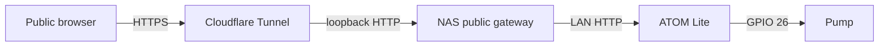

# Anonymous public gateway

`tree.example.com`のような公開ホストから、LAN内のATOM Liteへ安全に短時間の給水要求を中継するための構成です。公開ホスト名は例示であり、実IP、Tunnel credential、runtime DBはリポジトリへ入れません。

## 境界



ATOMのHTTP APIや組み込み管理画面を直接Tunnelへ接続しません。公開されるのはNAS gatewayの次の経路だけです。

- `GET /`: 公開操作画面
- `GET /api/status`: 公開用に絞った状態
- `POST /api/water`: bodyは空のJSON objectだけ
- `POST /api/stop`: bodyは空のJSON objectだけ
- `GET /healthz`: gateway processの生存確認

公開給水の既定値は次のとおりです。

- 1回10秒固定
- 全体cooldown 60秒
- rolling 1時間で最大6回
- rolling 24時間で最大24回
- hold mode、任意秒数、水量指定は非公開
- 同時要求はSQLiteの`BEGIN IMMEDIATE`で1件だけ予約
- 結果不明の給水POSTは再送せず`UNKNOWN`としてquotaに含める
- stopはquotaに関係なく常時転送

制限値は環境変数で厳しくする方向だけ変更できます。給水時間は10秒固定、cooldownは60秒以上、1時間上限は6回以下、24時間上限は24回以下です。上限を広げる変更はcode reviewと、流量、排水、タンク容量の再確認が必要です。

## NAS user service

通常運用先は常時稼働NASです。
root権限を必要としないuser serviceとして動かします。
gatewayは1 user serviceにつき1 processで運用し、複数processやworkerを同時起動しません。
SQLiteのquota予約はprocess間でもatomicですが、water/stopの直列化lockはprocess-localです。

想定layout:

```text
~/apps/balcony-watering/
├── current -> releases/<release>
├── shared/
│   ├── public.env           mode 600
│   ├── public.db            runtime、Git管理外
│   └── tunnel.token         mode 600、Git管理外
└── releases/
    └── <release>/
        └── app/             wheel展開先
```

bridgeはstdlib-onlyです。`ensurepip`や`python3-venv`がないNASでも動かせるよう、build済みwheelをprivate release directoryへ展開し、`current` symlinkをatomicに切り替えます。

```bash
set -euo pipefail
shopt -s nullglob
uv build --project bridge
base="$HOME/apps/balcony-watering"
release="$base/releases/$(date -u +%Y%m%dT%H%M%SZ)"
wheels=(bridge/dist/*.whl)
if (( ${#wheels[@]} != 1 )); then
  printf 'expected exactly one bridge wheel, found %d\n' "${#wheels[@]}" >&2
  exit 1
fi
wheel=${wheels[0]}
install -d -m 700 "$release/app" "$base/shared"
python3 -m zipfile -e "$wheel" "$release/app"
(
  cd "$release/app"
  /usr/bin/python3 -c 'from balcony_watering.public_main import main'
)
# 初回だけplaceholderを配置し、既存の本番設定は保持する。
test -f "$base/shared/public.env" ||
  install -m 600 bridge/public.example.env "$base/shared/public.env"
ln -sfn "$release" "$base/current.next"
mv -Tf "$base/current.next" "$base/current"
```

wheelは信頼するローカルbuildまたはCI artifactだけを使用し、依存packageやbinary extensionを追加した場合はこの展開方式を再評価します。

`public.env`のplaceholderを環境に合わせて更新します。ATOM URLはprivate/local HTTP originだけが有効です。listenerはloopback以外を拒否します。

user unitを配置します。

```bash
set -euo pipefail
install -d ~/.config/systemd/user
install -m 644 bridge/systemd/tree-public-gateway.service \
  bridge/systemd/tree-public-tunnel.service \
  ~/.config/systemd/user/
systemctl --user daemon-reload
systemctl --user enable tree-public-gateway.service
systemctl --user restart tree-public-gateway.service
```

`loginctl show-user "$USER" -p Linger`が`yes`であることを確認します。`no`の場合だけNAS管理者がlingerを有効化します。

## Cloudflare Tunnel

`cloudflared`は公式releaseのARM64 binaryと公開checksumを照合し、`~/.local/bin/cloudflared`へ置きます。Tunnelはremote-managedで作成します。

Cloudflare APIまたはDashboardでTunnelとDNS routeを作成し、ingressを`http://127.0.0.1:8787`へ設定します。Tunnel tokenはNASへ安全に転送し、CLI引数、Git、env fileへ入れません。

```bash
install -m 600 /secure/path/tunnel.token \
  ~/apps/balcony-watering/shared/tunnel.token
```

別zone用の`~/.cloudflared/cert.pem`を`cloudflared tunnel route dns`へ流用しません。DNS作成後はAPIのrecord name/contentとpublic resolverの両方で完全なhostnameを照合します。

```bash
set -euo pipefail
systemctl --user enable tree-public-tunnel.service
systemctl --user restart tree-public-tunnel.service
systemctl --user status tree-public-gateway.service tree-public-tunnel.service
```

## Verification

公開水やり前にread-only経路を確認します。

```bash
curl --fail --silent https://tree.example.com/healthz
curl --fail --silent https://tree.example.com/api/status
```

`/api/status`が`online=true`、`state=IDLE`、`armed=true`、`pump=false`を返す場合だけ、計量容器または安全な吐出先で1回テストします。

```bash
curl --fail --silent \
  -H 'Content-Type: application/json' \
  --data '{}' \
  https://tree.example.com/api/water
```

確認項目:

- responseは`202`、`duration_sec=10`
- 同時に2回送っても一方だけが受理される
- 10秒でpumpが停止する
- 60秒以内の次要求は`429`
- `/api/stop`はcooldown中でも使える
- foreign browser Originとform content typeはpump操作前に拒否される
- 公開responseに内部IP、Wi-Fi情報、ATOM request historyを含めない

## Rollback

Tunnelを先に停止すると公開操作だけを閉じ、ATOMのローカル安全機能は維持されます。

```bash
systemctl --user disable --now tree-public-tunnel.service
systemctl --user disable --now tree-public-gateway.service
```

DNS recordを削除する場合も、Tunnel停止後に行います。ATOMへ直接向けたDNS、router port forwarding、Tunnel ingressは作成しません。
