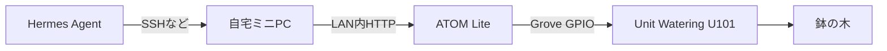
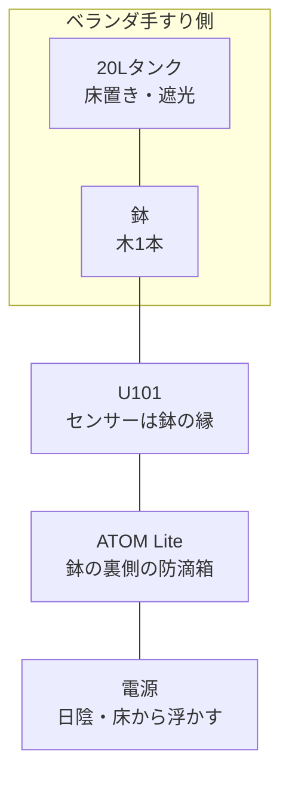
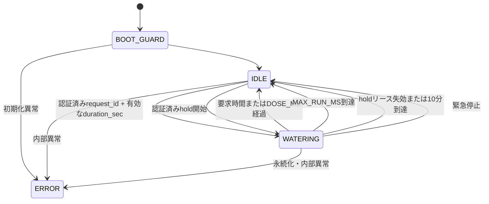

# ベランダ樹木 自動水やりシステム設計書

- Version: 1.3
- 更新日: 2026-08-08
- 対象: 屋根付きベランダの木1本、8号鉢程度
- 状態: ATOM LiteおよびUnit Watering U101を購入済み
- 関連文書: [開発ガイド](./development-guide.md)

## 1. 結論

ATOM Liteを自宅LAN内の専用給水デバイスとして動かし、自宅ミニPCをHermes Agentとの中継点にする。



ATOM LiteはLinux端末ではない。ESP32上で専用ファームウェアを直接実行し、次の役割を担当する。

- 2.4GHz Wi-Fiへの接続
- LAN内HTTP APIの提供
- ポンプのON/OFF
- ローカルタイマーによる確実な自動停止
- 水分センサー値の取得
- モバイル向け管理画面の配信
- 異常時の給水拒否

Tailscaleを使う場合はATOM Liteではなく自宅ミニPCに導入する。ATOM Liteはインターネットへ直接公開しない。

## 2. 目的

現在、木への給水を忘れることがあるため、次の2通りで安全に給水できる状態を作る。

1. Hermes Agentへ「木に水をあげて」と依頼して1回分を給水する
2. 流量校正と安定試験の完了後、3日に1回を目安に自動給水する

システムの最優先事項は、給水開始よりも「必ず予定時間で停止すること」である。

## 3. 現在の前提

| 項目 | 現在の条件 |
|---|---|
| 植物 | 木1本。8号鉢程度 |
| 現在の頻度 | およそ3日に1回 |
| 現在の給水量 | 2L容器の水がかなり余る。正確な量は未計測 |
| 計算上の給水量 | 暫定0.8-1.2L/回 |
| タンク | 20Lのコック付き水容器を所有済み |
| 水道 | ベランダにはなし |
| 設置場所 | 屋根付き、ガラス手すりのベランダ |
| 通信 | 自宅2.4GHz Wi-Fiを利用可能 |
| 中継機 | 自宅NASまたはミニPC。ミニPCを優先 |
| 電源 | モバイルバッテリーを所有済み。長期稼働は未検証 |

## 4. 購入品

2026年8月5日に次の2製品を購入済み。

| 製品 | 数量 | 商品価格 | 用途 |
|---|---:|---:|---|
| [M5Stack ATOM Lite](https://www.switch-science.com/products/6262) | 1 | 1,793円 | Wi-Fi通信、HTTP API、GPIO制御 |
| [M5Stack Unit Watering U101](https://www.switch-science.com/products/6913) | 1 | 2,189円 | 5Wポンプ、水分センサー、ポンプ制御回路 |
| 商品小計 | | 3,982円 | |
| 送料込み合計 | | 4,632円 | |

U101には次が含まれる。

- 給水ポンプ
- 静電容量式水分測定プレート
- ポンプ駆動回路
- チューブ2本
- 20cm Groveケーブル

ATOM LiteにはUSB-Cケーブルが付属しない。初回書き込みにはデータ通信対応USB-Cケーブルが必要。

## 5. 必要な追加物

### 所有済みとして扱うもの

- 20Lタンク
- モバイルバッテリー
- MacBook
- 自宅ミニPCまたはNAS
- 自宅Wi-Fi

### 現物到着後に判断するもの

| 部材 | 判断方法 |
|---|---|
| 防滴ボックス | ATOM Lite、Grove接続部、USB端子が収まるものを選ぶ |
| チューブ固定具 | 吐出口を鉢へ固定できる園芸ピンなどを選ぶ |
| 延長チューブ・継手 | 付属チューブの内径・外径と実距離を測ってから選ぶ |
| USB-Cケーブル | データ通信対応。屋外給電用は短く、電圧降下しにくいもの |
| タンク遮光カバー | タンク内の藻と水温上昇を防ぐため、必要に応じて追加 |

## 6. ベランダへの配置

動画で確認した範囲では、物理的な設置スペースは十分にある。

推奨配置は次の通り。



### タンク

- 鉢の横の床へ置く
- タンクの水面が鉢の吐出口より高くならないようにする
- 室外機の上には置かない
- 室外機の吸気・排気・点検スペースを塞がない
- 空気取入口を確保し、給水時にタンク内が負圧にならないようにする
- 吸水チューブ先端は底面から10-20mm程度浮かせる

### 鉢とU101

- 水分センサーは幹から離し、鉢の縁寄りへ挿す
- 吐出チューブ先端はセンサーのすぐ隣ではなく、反対側寄りへ固定する
- 吐出口を土へ深く埋めない
- チューブが風や振動で抜けないよう固定する

### ATOM Lite

- U101の付属Groveケーブルが20cmなので、鉢の近くへ置く
- 鉢の室内側または裏側に防滴ボックスで固定する
- ボックスは床へ直置きせず、水たまりより高い位置へ設置する
- ケーブル入口を下向きにし、ドリップループを作る
- 直射日光、雨の吹き込み、結露を避ける

### 排水確認

動画では、黒い内鉢が灰色の鉢カバーへ入っているように見える。自動給水前に次を確認する。

- 灰色の外鉢に排水穴があるか
- 内鉢と外鉢の間へ水が溜まっていないか
- 給水後に鉢底から出た水を安全に排出できるか

外鉢に排水がない場合、自動給水によって水が蓄積し、根腐れにつながる可能性がある。ここは自動化前の必須確認項目とする。

## 7. 機能要件

| ID | 機能 | 内容 |
|---|---|---|
| F-01 | Hermes手動給水 | 自然言語の依頼から1回分だけ給水する |
| F-02 | 定期給水 | 校正後、3日に1回を目安に実行できる |
| F-03 | 状態確認 | 待機、給水中、最終実行、水分値を取得する |
| F-04 | 緊急停止 | 給水中に停止命令を受けたら直ちにポンプを停止する |
| F-05 | 重複防止 | 同じ依頼や短時間の再依頼で二重給水しない |
| F-06 | 残量推定 | 成功した給水量から20Lタンクの残量を概算する |
| F-07 | オフライン通知 | ATOMへ接続できなければ成功扱いにせず、Hermesへ失敗を返す |
| F-08 | Web管理画面 | 水分値と推移を確認し、1-180秒の1回給水、押下中だけの長時間給水、緊急停止を行う |

## 8. 非機能要件

### 安全性

- 電源投入直後は必ずpump OFF
- U101基板上の10kΩゲートとソース間のプルダウン（R1）と、起動直後にGPIO26をLOWへ設定するファームウェアを併用する
- 通信が切れてもATOM側のタイマーで停止
- 時間指定Web要求は整数1-180秒かつ`MAX_RUN_MS`以内に限定する
- 180秒を超える手動運転は押下中のholdモードだけとし、500msごとの生存信号、1,500msのローカルリース、600,000msの絶対上限を適用する
- holdのkeepalive単体ではポンプを開始・再開できず、別`request_id`のリースを延長できない
- 異常時は給水しない方向へ倒す
- 結果不明時は自動再送しない

### セキュリティ

- ATOMをインターネットへ公開しない
- ルーターでポート転送しない
- APIにランダムな認証トークンを設定する
- 初期版のHTTPは信頼できるWPA2/WPA3 LAN内だけで使い、ゲスト端末や不特定端末と同じネットワークへ置かない
- LANの認証情報が漏えいした疑いがある場合は、Wi-Fi認証情報とAPIトークンを交換する
- Hermesには任意のHTTPや任意の秒数ではなく、固定コマンドだけを許可する
- 管理画面へトークンを埋め込まず、入力値はブラウザタブの`sessionStorage`だけに保持する
- Wi-FiパスワードとAPIトークンをGitへコミットしない

### 保守性

- 給水量と運転時間を設定値として分離する
- 実行履歴と失敗理由をミニPCへ記録する
- ATOMのIPアドレスはルーターのDHCP予約で固定する
- 初回はUSB書き込み、OTA更新は安定後の任意機能とする

## 9. 通信設計

### 採用方式

Hermes Agentから自宅ミニPCへ接続し、ミニPCからATOM LiteのLAN内HTTP APIを呼び出す。

```text
Hermes Agent
  -> 自宅ミニPCの固定コマンド
  -> http://ATOMのローカルIP/v1/water
  -> ATOMがローカルタイマーでポンプ制御
```

### MQTTを初期版で採用しない理由

MQTTは複数のセンサーやデバイスを統合する場合に便利だが、木1本・ポンプ1台の初期構成では中継サーバーの管理が増える。初期版はHTTPで完成させ、次の場合に再検討する。

- 植物やポンプが複数になった
- Home Assistantを導入した
- センサー値をダッシュボード化したい
- 通知やオンライン状態を共通基盤へまとめたい

## 10. 給水制御

ATOMの状態は次のように管理する。



通常の`millis()`状態機械に加え、給水開始時に独立したone-shotタイマーを
受理済みの要求時間（省略時は`DOSE_MS`）で起動する。要求時間は事前に
`MAX_RUN_MS`と180秒絶対上限で検証する。
メインループやWi-Fi処理が停止してもタイマー側でGPIO26をLOWへ落とす。
タスクWatchdogによる再起動を予備停止手段とする。

押下中のholdモードは、長い運転時間を一括予約しない。開始時に独立タイマーを
1,500msで起動し、同じ`request_id`の有効なkeepaliveを受けた場合だけ同じ
タイマーを延長する。タイムアウト済みの安全ゲートはkeepaliveで再armしない。
ブラウザは500msごとにkeepaliveを送り、指を離す、pointer cancel、画面非表示、
通信失敗のいずれでも`POST /v1/stop`を送る。停止要求自体が届かなくても、
keepaliveが途切れて1,500ms以内にGPIO26がLOWになる。押しっぱなしやUI不具合に
備え、状態機械も600,000msで絶対停止する。
M5Stack公式資料にある5 Wはメーカー公称値であり、本個体の消費電力と連続デューティは
未実測である。10分は暫定値とし、発熱・実流量・鉢の排水を確認せずに延長しない。

### 制御パラメータ

| 設定 | 初期方針 | 目的 |
|---|---|---|
| `DOSE_MS` | 初期10秒、流量校正後に決定 | `duration_sec`省略時の標準運転時間 |
| `MAX_RUN_MS` | 180000ms以下 | 要求値検証と独立タイマーの絶対上限 |
| `COOLDOWN_MS` | 0ms | 完了・停止直後から別IDの次要求を受付 |
| `BOOT_GUARD_MS` | 5分 | 再起動直後の誤作動防止 |
| `kHoldLeaseMs` | 1500ms（固定） | hold生存信号が途切れた場合のローカル停止 |
| `kHoldMaxRunMs` | 600000ms（固定） | 1回の押しっぱなしに対する絶対上限 |

手動管理画面だけは整数秒の`duration_sec`を受け付ける。範囲は1-180秒かつ
`MAX_RUN_MS`以内であり、上限と停止タイマーはESP32側が保持する。
180秒を超える場合は、利用者がボタンを押し続けるholdモードだけを使う。
hold開始要求は時間値を受け付けず、クライアントがリース長や10分上限を変更できない。
低レベルの`AtomClient.water()`はAPI契約を表現する任意の`duration_sec`を持つ。
一方、出荷するBridge service/CLIとHermesコマンドは秒数を公開・送信せず、
引き続き「標準1回分」だけを実行する。現在のユーザー向け可変秒数経路は管理画面だけである。
同じ`request_id`と給水中の並行要求は拒否するが、完了後の待機時間は設けない。

## 11. 水分センサーの扱い

水分センサーは必須の判断装置ではなく、段階的に利用する。

| 段階 | 使い方 | 条件 |
|---|---|---|
| Phase 1 | 観測のみ | 給水前後のADC値を記録し、自動判断には使わない |
| Phase 2 | 湿潤時の中止 | 2週間以上の実測から、確実に湿っている場合だけ定期給水をスキップ |
| Phase 3 | 乾燥起点 | 季節・土・挿入位置の誤差を評価した後に検討 |

初期段階では時間制御を主とし、センサー値は観測・記録だけに使う。

## 12. 流量校正

ポンプの流量は仕様から推測せず、本番のチューブ長、高低差、電源で測定する。

1. 吐出チューブを計量容器へ入れる
2. 呼び水を行う
3. 10秒給水を3回実行する
4. 3回の水量を測る
5. 平均値から流量を計算する
6. 目標水量に必要な時間を計算する
7. 算出した時間でもう一度実測する

計算式:

```text
flow_ml_s = 10秒間の平均水量ml / 10
dose_s    = 目標水量ml / flow_ml_s
DOSE_MS   = dose_s * 1000
```

3回の測定値が平均から10%以上ばらつく場合は、チューブの折れ、空気漏れ、タンク通気、電圧降下を確認する。

## 13. 20Lタンクの持続日数

吸い込み不良と誤差のため2Lを予備とし、使用可能量を18Lで計算する。

| 1回量 | 20Lの理論回数 | 18Lでの運用回数 | 3日ごとの持続日数 |
|---:|---:|---:|---:|
| 0.8L | 25回 | 22回 | 約66日 |
| 1.0L | 20回 | 18回 | 約54日 |
| 1.2L | 約16回 | 15回 | 約45日 |

実際には蒸発、チューブ残水、流量誤差があるため短めに見る。残り3回分未満になったら補充通知を出し、週1回は目視する。

## 14. 電源設計

### 必要条件

- 5V / 2A以上を目安にする
- ポンプ始動時にATOMが再起動しないこと
- 待機中にモバイルバッテリーが自動停止しないこと
- 直射日光と高温を避けること

ポンプの稼働時間は短く、消費電力の中心は24時間待ち受けるATOM Liteになる。一般的なモバイルバッテリーでは、低負荷自動OFFまたは数日程度の電池切れが起きる可能性がある。

### 72時間試験

| 時点 | 確認内容 |
|---|---|
| 開始 | 満充電し、本番ケーブルで接続する |
| 24時間 | ATOMのオンライン状態、自動OFF、ケース温度を確認する |
| 48時間 | 模擬給水し、ポンプ始動で再起動しないことを確認する |
| 72時間 | 稼働継続と残量を確認する |

最低7日、理想14日以上を目標にする。満たさない場合は次の順で電源を再検討する。

1. 室内からの安全なUSB給電
2. 容量が大きく常時給電できるバッテリー
3. 屋外向けに設計された電源システム

夏季のベランダでモバイルバッテリーを密閉箱へ入れ、直射日光下に放置しない。

## 15. 障害モードと対策

| 障害 | 影響 | 対策 |
|---|---|---|
| Hermesが命令を重複送信 | 過剰給水 | `request_id`重複拒否、給水中の並行要求拒否 |
| 時間指定給水中に通信断またはメインループ停止 | 停止不能の懸念 | 独立one-shotタイマーでGPIO26をLOW、Watchdogを予備停止にする |
| hold中にブラウザ・Wi-Fi・中継が停止 | 押下解除を通知できない | 500ms heartbeatが途切れると独立1,500msタイマーでGPIO26をLOWにする |
| hold UIが押下状態のまま固着 | 長時間運転 | 600,000ms絶対上限で停止し、再度の押下を要求する |
| ATOM再起動 | GPIO誤動作 | 起動直後にGPIO26をLOW、BOOT_GUARD |
| ポンプ始動時に電圧低下 | ATOM再起動 | 5V / 2A以上、短いUSBケーブル、実機試験 |
| 吐出チューブ脱落 | 床へ放水 | 園芸ピンで固定、受け皿側へ配置 |
| タンク位置が高い | サイフォン継続 | タンクを床置きし、停止後5分観察 |
| タンク空 | ポンプ空運転 | 残量推定、補充通知、週1回目視 |
| 水分センサー誤判定 | 過少・過剰給水 | 初期は観測のみ |
| 外鉢に排水がない | 根腐れ | 自動化前に排水構造を確認 |
| バッテリー高温 | 劣化・安全リスク | 日陰、温度条件順守、恒久運用では室内電源優先 |

## 16. 段階導入

| Phase | 作業 | 完了条件 |
|---|---|---|
| 0 | 開梱、付属品、USBケーブル、給電確認 | 部品不足なし |
| 1 | MacからATOMへ最小ファームを書き込む | LEDとシリアル出力が動作 |
| 2 | U101を接続し、10秒だけポンプを動かす | 3回連続で予定通り停止 |
| 3 | HTTP APIと安全状態機械を実装する | 認証、停止、重複拒否が動作 |
| 4 | 本番配管で流量校正する | 3回のばらつきが10%以内 |
| 5 | ミニPCとHermesを連携する | 自然言語から1回だけ実行可能 |
| 6 | ベランダで72時間試験する | 電源、温度、Wi-Fi、漏水に問題なし |
| 7 | 3日ごとの自動給水を有効化する | 最初の2週間を目視確認 |
| 8 | 水分値による湿潤時スキップを追加する | 実測データから閾値を決定済み |

## 17. 受入条件

- [ ] 電源投入・再起動を10回行っても、意図しないポンプ起動がない
- [ ] 通信を切断しても設定時間で停止する
- [ ] hold中に通信を切断すると1,500ms以内にポンプが停止する
- [ ] keepaliveだけ、別`request_id`、停止後の遅延keepaliveではポンプが始動しない
- [ ] keepaliveを継続してもhold開始から600,000msで停止する
- [ ] 同じ`request_id`で2回給水しない
- [ ] 給水中の緊急停止が機能する
- [ ] トークンなし、誤トークンではポンプが動かない
- [ ] 本番配管で給水量が目標の10%以内に収まる
- [ ] 停止後5分間、サイフォンによる継続流出がない
- [ ] チューブ接続部とタンクから漏水しない
- [ ] 72時間以上オンラインを維持する
- [ ] ポンプ始動時にATOMが再起動しない
- [ ] Hermesが成功、拒否、オフライン、結果不明を区別して返す
- [ ] 外鉢に水が蓄積しない

## 18. 参考資料

- [M5Stack公式 ATOM Lite](https://docs.m5stack.com/en/core/ATOM%20Lite)
- [M5Stack公式 Unit Watering U101](https://docs.m5stack.com/ja/unit/watering)
- [M5Stack公式 Unit Watering U101回路図PDF](https://m5stack-doc.oss-cn-shenzhen.aliyuncs.com/729/U101_Unit-Watering_SCH.pdf)
- [M5Stack公式 Unit Watering Home Assistant Integration](https://docs.m5stack.com/en/homeassistant/sensor/unit_watering_sensor)
- [スイッチサイエンス ATOM Lite](https://www.switch-science.com/products/6262)
- [スイッチサイエンス Unit Watering U101](https://www.switch-science.com/products/6913)
- [Tailscale公式 Download](https://tailscale.com/download)

## 19. 未確定事項

実機到着後、次の値を確定する。

- 実際の1回給水量
- `DOSE_MS`
- 付属チューブの寸法と延長要否
- モバイルバッテリーの連続稼働日数
- ベランダ設置位置でのWi-Fi強度
- 外鉢の排水構造
- 水分センサーの乾燥時・湿潤時ADC値
